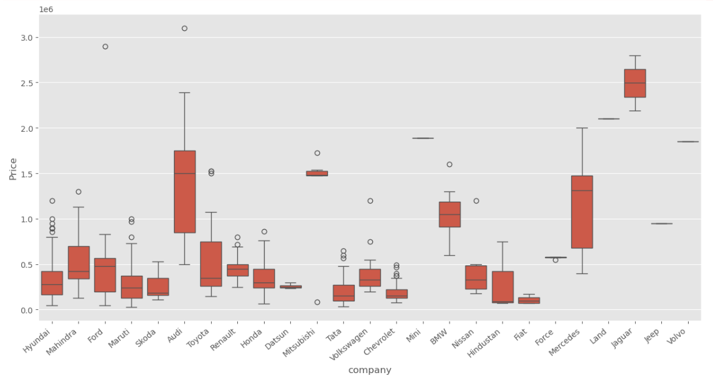
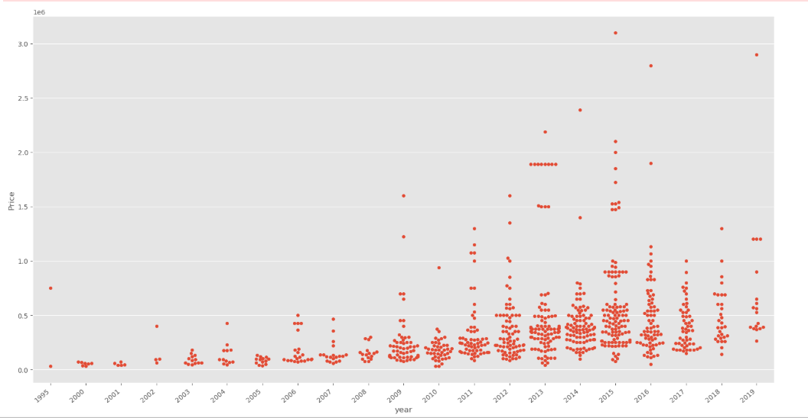
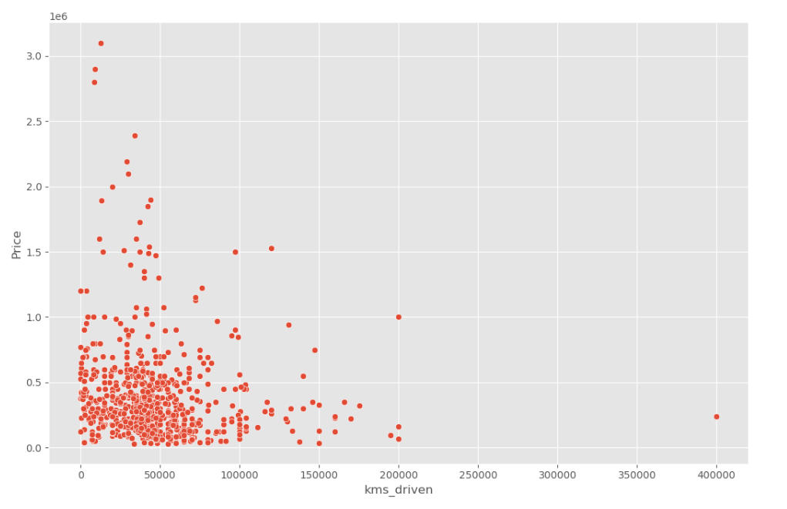
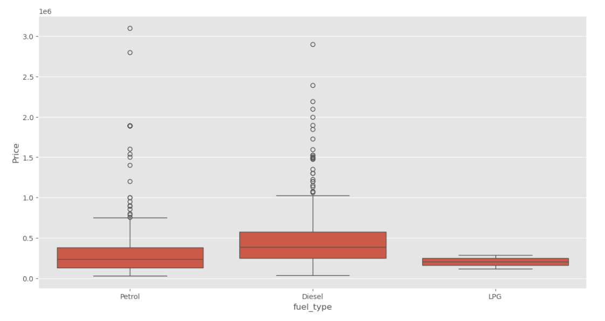
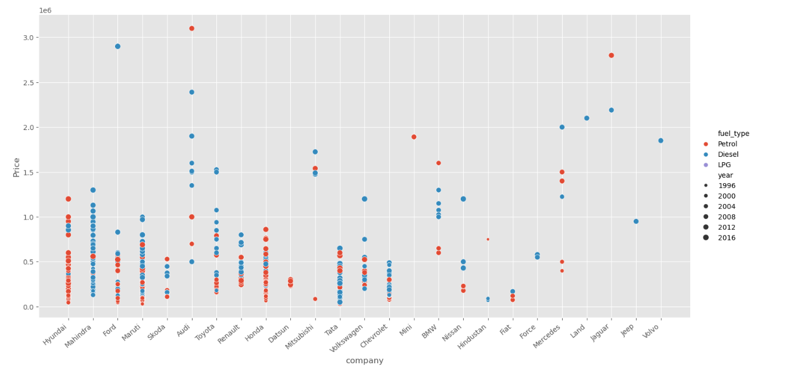

# 🚗 Quikr Used Car Market Analysis

<p align="center">


</p>

---

## 📖 Overview

**Quikr Used Car Market Analysis** is an end-to-end **Exploratory Data Analysis (EDA)** project developed using **Python**. The project focuses on cleaning real-world used car data, exploring pricing trends, understanding market behavior, and extracting actionable business insights through data visualization.

This project demonstrates a complete data analysis workflow, including **data cleaning, preprocessing, exploratory analysis, visualization, and insight generation**.

---

## 🎯 Objectives

- Clean messy real-world automobile data
- Handle missing and inconsistent values
- Explore factors affecting used car prices
- Analyze market trends through visualization
- Generate meaningful business insights
- Prepare data for future Machine Learning models

---

## 📂 Dataset Features

The dataset contains information about used cars listed on **Quikr**.

| Feature | Description |
|---------|-------------|
| Car Name | Name of the vehicle |
| Company | Manufacturer |
| Year | Manufacturing Year |
| Price | Selling Price |
| Kilometers Driven | Distance covered |
| Fuel Type | Petrol / Diesel / LPG |

---

## 🛠️ Tech Stack

| Technology | Purpose |
|------------|---------|
| Python | Programming Language |
| Pandas | Data Cleaning & Analysis |
| NumPy | Numerical Computing |
| Matplotlib | Data Visualization |
| Seaborn | Statistical Visualization |
| Jupyter Notebook | Development Environment |

---

## 📁 Repository Structure

```text
quikr-used-car-analysis/
│
├── images/
│   ├── 01_company_price_distribution.png
│   ├── 02_price_vs_manufacturing_year.png
│   ├── 03_price_vs_kms_driven.png
│   ├── 04_fuel_type_vs_price.png
│   └── 05_company_fuel_price_analysis.png
│
├── Quikr_Analysis.ipynb
├── quikr_car.csv
├── Cleaned_Car_data.csv
├── LinearRegressionModel.pkl
├── requirements.txt
├── .gitignore
└── README.md
```

---

## 🔄 Project Workflow

```text
Raw Dataset
      │
      ▼
Data Cleaning
      │
      ▼
Feature Engineering
      │
      ▼
Exploratory Data Analysis
      │
      ▼
Data Visualization
      │
      ▼
Business Insights
```

---

## 📊 Exploratory Data Analysis

The project includes:

- ✅ Data Cleaning
- ✅ Missing Value Handling
- ✅ Duplicate Removal
- ✅ Data Type Conversion
- ✅ Company-wise Analysis
- ✅ Manufacturing Year Analysis
- ✅ Fuel Type Analysis
- ✅ Kilometers Driven Analysis
- ✅ Price Distribution Analysis
- ✅ Price vs Manufacturing Year
- ✅ Price vs Kilometers Driven
- ✅ Company-wise Price Comparison

---

## 📸 Project Visualizations

### 1️⃣ Company-wise Price Distribution

Comparison of resale prices across different automobile manufacturers.



---

### 2️⃣ Price vs Manufacturing Year

Shows how manufacturing year influences the resale price of used cars.



---

### 3️⃣ Price vs Kilometers Driven

Illustrates the relationship between kilometers driven and selling price.



---

### 4️⃣ Fuel Type vs Price

Comparison of resale prices across Petrol, Diesel, and LPG vehicles.



---

### 5️⃣ Company, Fuel Type & Price Analysis

Combined visualization showing the influence of company, fuel type, and manufacturing year on vehicle prices.



---

## 📈 Key Insights

- Premium automobile brands generally retain higher resale values.
- Vehicle age has a significant impact on resale price.
- Cars with lower mileage tend to have higher market value.
- Diesel vehicles generally command higher resale prices than Petrol and LPG vehicles.
- Proper data cleaning significantly improves the quality of analysis.

---

## 🚀 Installation

### Clone the Repository

```bash
git clone https://github.com/naitik2043/quikr-used-car-analysis.git
```

### Navigate to the Project

```bash
cd quikr-used-car-analysis
```

### Install Dependencies

```bash
pip install -r requirements.txt
```

### Launch Jupyter Notebook

```bash
jupyter notebook
```

Open:

```text
Quikr_Analysis.ipynb
```

and run all cells.

---

## 📌 Future Enhancements

- 🤖 Car Price Prediction using Machine Learning
- 📊 Interactive Dashboard using Plotly
- 🌐 Streamlit Web Application
- 📈 Feature Importance Analysis
- 🔍 Model Performance Comparison

---

## 🤝 Contributing

Contributions are welcome!

1. Fork the repository.
2. Create your feature branch.

```bash
git checkout -b feature-name
```

3. Commit your changes.

```bash
git commit -m "Add new feature"
```

4. Push to the branch.

```bash
git push origin feature-name
```

5. Open a Pull Request.

---

## 👨‍💻 Author

### Naitik Gupta

- 💼 LinkedIn: https://www.linkedin.com/in/naitikgupta2043
- 🐙 GitHub: https://github.com/naitik2043

---

## ⭐ Support

If you found this project useful, consider giving it a ⭐ on GitHub.

Your support motivates me to build more open-source Data Science projects.

---

<p align="center">

### 🚀 Happy Coding & Happy Learning!

Made with ❤️ using **Python**, **Pandas**, **NumPy**, **Matplotlib**, and **Seaborn**.

</p>
